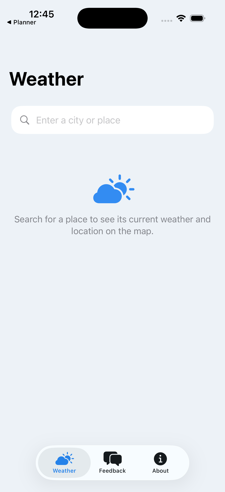

# Weather

A native **iOS** weather app built with **SwiftUI**. Search for any city or place, pull live
current conditions from the free **[Open-Meteo](https://open-meteo.com)** API, and see the
location pinned on an **Apple Map** — all behind a clean bottom-tab navigation.



## Features

- 🔎 **Search any city or place** — free-text geocoding via Open-Meteo.
- 🌡️ **Live current weather** — temperature, feels-like, humidity, wind, and a WMO
  condition label with a matching SF Symbol (day/night aware).
- 🗺️ **Location on Apple Maps** — the resolved place is dropped as a `Marker` on a MapKit map.
- 🧭 **Bottom-tab navigation** — Weather, Feedback (Title + Message → WhatsApp), and About.
- 🌗 **Light & dark mode** — semantic `Theme` color tokens backed by Asset Catalog variants.
- ♿ **HIG-friendly** — Dynamic Type, SF Symbols, 44pt hit targets, VoiceOver labels.

## Tech Stack

| Layer | Choice |
|-------|--------|
| UI | SwiftUI (iOS 17+), `@Observable` state |
| Maps | MapKit (`Map` + `Marker`) |
| Networking | `URLSession` async/await |
| Data source | [Open-Meteo](https://open-meteo.com) geocoding + forecast APIs (no key required) |
| Project gen | [XcodeGen](https://github.com/yonaskolb/XcodeGen) (`project.yml`) |

## Architecture

```
Sources/
├── WeatherApp.swift        # @main App entry
├── MainTabView.swift       # Root TabView: Weather / Feedback / About
├── WeatherView.swift       # Search field, weather card, MapKit map
├── WeatherViewModel.swift  # @Observable: idle / loading / loaded / failed
├── WeatherService.swift    # Open-Meteo geocoding + forecast (async/await)
├── WeatherModels.swift     # Codable models + WMO code → label/symbol
├── FeedbackView.swift      # Title + Message → WhatsApp (wa.me)
├── AboutView.swift         # App / developer / data-source / version cards
└── Theme.swift             # Central color tokens + card surface
Resources/
├── Info.plist              # Endpoints + optional OpenMeteoAPIKey
└── Assets.xcassets         # Accent / Card / Background color sets, AppIcon
```

## Getting Started

**Requirements:** macOS with Xcode 17+, [XcodeGen](https://github.com/yonaskolb/XcodeGen)
(`brew install xcodegen`).

```bash
# 1. Generate the Xcode project from project.yml
xcodegen generate

# 2. Open and run
open WeatherApp.xcodeproj
#    ⌘R on an iPhone simulator or a signed physical device

# …or build from the CLI for the simulator
xcodebuild -project WeatherApp.xcodeproj -scheme WeatherApp \
  -destination 'platform=iOS Simulator,name=iPhone 17 Pro' build
```

> `WeatherApp.xcodeproj` is generated from `project.yml` and is git-ignored — run
> `xcodegen generate` after cloning.

## Configuration

Open-Meteo's free tier needs **no API key**. The forecast/geocoding endpoints (and an optional
`OpenMeteoAPIKey` for the commercial tier) live in `Resources/Info.plist` and are read at
runtime by `WeatherService` — set the key there and it's appended automatically.

## Data Source

Weather and geocoding data © [Open-Meteo.com](https://open-meteo.com), licensed under
CC BY 4.0.

## Acknowledgements

Developed by [Tertiary Infotech Academy Pte Ltd](https://www.tertiaryinfotech.com).
